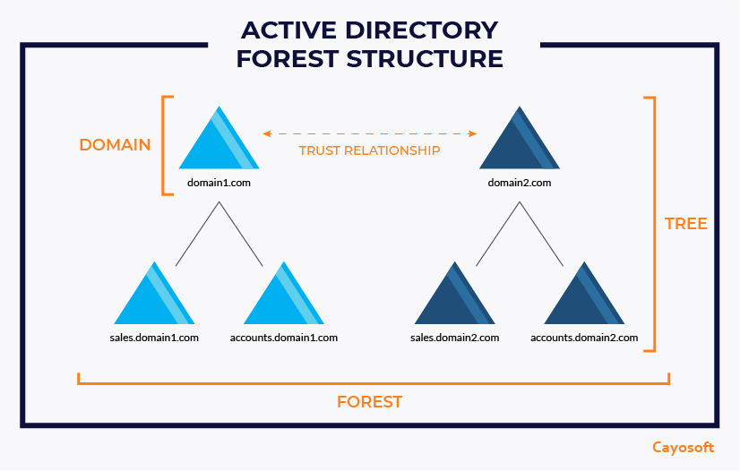

# Active Directory

Definition

Active Directory (AD) is a Microsoft directory service used to manage networks, including users, computers, and other resources. It centralizes domain management, handles authentication and authorization, and enforces policies.

Active Directory Components

- **Objects**: Objects are the most bottom part of AD for example employees of a company is an object .  Objects have some attribute such as Employees ID, Employees Name etc., Physical devices a such as printer are also comes in objects
- **Domain**: A logical group of network objects (such as users, computers, and devices) that share the same AD database. The domain is the primary organizational unit in AD. It provides a hierarchical structure for organizing these resources based on administrative needs. Each domain has its own security policies, user accounts, group policies, and other settings.

    — Example: [Example.com](http://Example.com) will be parent domain and it might has to sub domain as [in.example.com](http://in.example.com) and [uk.example.com](http://uk.example.com) and this two might have more subdomain as [student.in.example.com](http://student.in.example.com) and  student.uk.example.com

**Organizational Unit (OU)**: A container for organizing users, groups, and computers within a domain. OUs are used to apply group policies and simplify management.

               — **OU for IT Department**: `IT` 

                  Contains:

                        >>Users: `alice@example.com`, `bob@example.com`

                        >>Computers: `IT-PC01`, `IT-PC02`

                  **—OU for HR Department**: `HR`

           Contains:

                 >>Users: `carol@example.com`, `david@example.com`

                        >>Computers: `HR-Laptop01`, `HR-Desktop02`

- **Domain Controller (DC)**: A server that hosts the AD database. A Domain controller is a server that runs the Active Directory Domain Services role. It stores user account information, manages authentication and authorization requests, and replicates changes to other domain controllers in the same domain. A domain can have multiple domain controllers to provide redundancy and fault tolerance.
- **Tree**: A hierarchical arrangement of domains in a forest. Domains in a tree share a contiguous namespace.
Think of a tree as a group of domains that share a common root. For example, if you have `example.com` as your main domain, and `sales.example.com` and `hr.example.com` as subdomains, they are part of the same **tree**. It’s like branches of a single tree growing from the same trunk (root domain).
- **Forest**: A forest is the top-level container in AD, and it contains one or more trees. So if you have multiple trees (like `example.com` and `anotherdomain.com`), they can exist together in a **forest**. A forest is like a collection of trees that might be connected or separate but belong to the same overall environment.
- **Sites**: refer to physical locations (like offices in different cities) where your network might exist. Even if a company has one domain (one tree), it might have multiple **sites**. AD uses **sites** to optimize how data is transferred over the network, especially when locations are far apart.



Active Directory Services 

- **DNS (Domain Name System)**: AD heavily relies on DNS for domain controller location and other network services. It’s essential to configure DNS properly when setting up AD.DNS is like the phone book of the internet. It translates human-readable domain names (like `example.com`) into IP addresses (like `192.168.1.1`) that computers use to identify each other on the network.
- **LDAP (Lightweight Directory Access Protocol)**: AD uses LDAP as the protocol for directory queries. It allows applications and services to query and modify directory data.LDAP is a protocol used to access and manage directory services.LDAP uses a hierarchical structure to organize directory information, making it easier to retrieve and manage.
- **Kerberos Authentication**: AD uses Kerberos as its primary authentication protocol for secure authentication of users and services. Kerberos is a network authentication protocol designed to provide secure authentication for users and services. It uses tickets to allow nodes to prove their identity in a secure manner.

Roles of AD

AD has five Flexible Single Master Operations (FSMO) roles, which are essential for proper functioning:

- **Schema Master**:  The Schema Master manages the structure of the Active Directory database, known as the schema. The schema defines what types of objects (like users, computers, or groups) can exist in AD and what attributes (like name, email, or phone number) those objects can have. **Example**: If your organization decides to add a new attribute called “EmployeeID” to user accounts, the Schema Master is responsible for making that change to the schema so that all domain controllers can recognize this new attribute.
- **Domain Naming Master**: The Domain Naming Master controls the addition and removal of domains within the forest (the collection of all domains). **Example**: If your company wants to create a new domain for a new branch office, like `branch.example.com`, the Domain Naming Master ensures that this new domain name is unique within the forest and allows the creation of this new domain.
- **RID Master**: The RID Master allocates unique identifiers (called Relative Identifiers or RIDs) to each domain controller in a domain. These identifiers are used to create new objects (like user accounts or groups).**Example**: When you create a new user account, the domain controller needs a unique ID for that user. The RID Master assigns a pool of RIDs to the domain controller, allowing it to create new accounts without duplication.

**Group Policy**

- **Definition**: Group Policy allows administrators to implement settings (e.g., security, software installation) across users and computers within the AD environment.
- **Group Policy Objects (GPOs)**: Policies linked to OUs, sites, or domains that define rules for objects (e.g., password policies, software restrictions, etc.).

 **Replication**

- **Intra-Site Replication**: Fast replication between domain controllers in the same site.
- **Inter-Site Replication**: Slower replication between domain controllers in different sites, often scheduled to conserve bandwidth.

**Active Directory Database**

**NTDS.dit**

**NTDS.dit** is the main database file for Active Directory (AD). It stores all the information about objects in the directory, such as users, computers, groups, and their associated attributes.

- **Example**: Imagine you have a library. The **NTDS.dit** file is like the library catalog that keeps track of every book (user, computer, or group) in the library. When you add a new book (user), check it out (log in), or look it up (query for information), the catalog (NTDS.dit) is updated with the relevant details.

**SYSVOL**

 **SYSVOL** is a shared folder on domain controllers that stores important files needed for group policies and login scripts. It ensures that these files are available to all domain controllers in the domain.

- **Example**: Think of **SYSVOL** like a community bulletin board. It contains important notices (group policies) and instructions (login scripts) that everyone in the community (domain) can access. For instance, if there’s a new policy that requires all users to change their passwords every 90 days, this information is stored in the **SYSVOL** folder, ensuring that all computers in the domain can apply this policy.

 **Trust Relationships**

- **Trusts**: Trust relationships enable users from one domain to access resources in another domain.
- **Types of Trusts**:
    - **External Trust**: Connects domains in different forests.
    - **Transitive Trust**: A trust that automatically extends to all objects in the trusted domains.
    - **Two-way Trust**: Allows for mutual trust between domains.

 **Security and Permissions**

- **Security Principals**: Objects (users, computers, etc.) that can have permissions and access controls assigned.
- **Access Control Lists (ACLs)**: Defines which users or groups have access to specific resources and what actions they can perform.

**Backup and Recovery**

- **System State Backup**: A backup of key system files, including the AD database, required for recovery in case of failure.
- **Authoritative vs Non-Authoritative Restore**:
    - **Authoritative Restore**: Restores AD objects with precedence over current data.
    - **Non-Authoritative Restore**: Restores AD data, but the restored data will be updated by other domain controllers via replication.

**Tools for Managing AD**

- **Active Directory Users and Computers (ADUC)**: A GUI tool for managing users, groups, computers, and OUs.
- **Active Directory Administrative Center (ADAC)**: A more modern management interface with enhanced features.
- **PowerShell**: Essential for scripting and automating AD tasks (commands like `Get-ADUser`, `New-ADUser`, etc.).

How to set up an AD

Prerequisites

- **Installed Windows Server 2022**: In your VirtualBox, ensure you have Windows Server 2022 installed and running.
- **Set IP** (optional but recommended for AD servers).

follow this step to  set Ip

Open network setting, You can do this by searching ncpa.cpl or manually navigating into it 


Now, Select Ethernet —> Properties


Then click on IPV4 


Now set the ip addres and then click ok 


Note: Do not copy mine 

Now we will set up server 

Step 1: Open the server manager in windows 2022 AD server 


Step2 :  In Server Manager, click on **Manage** in the top-right corner and select **Add Roles and Features**.


Step 3:In the Wizard that appears, click **Next** until you reach the **Installation Type** section. Select **Role-based or feature-based installation**.


Step 4: In the next step, select the server from the pool (should be your Windows Server 2022). Click **Next**.


Step 5: On the **Select server roles** page, check the **Active Directory Domain Services (AD DS)** checkbox.


Continue clicking **Next** through the wizard, leaving defaults as they are, until you reach the **Install** button. Click **Install**.

Now Promote it to Domain Controller,

After the AD DS role installation completes, you will see a notification in the **Server Manager Dashboard** (yellow triangle in the top right).

Click on this notification and choose **Promote this server to a domain controller**.


Now, Configure Your domain Name

**>> Deployment Configuration**:

—In the wizard that opens, choose **Add a new forest** and specify your **Root domain name** (e.g., Baki.local). Click **Next**.


**>>Domain Controller Options**:—On this page, ensure **Domain Name System (DNS) server** and **Global Catalog (GC)** are checked. Enter a **Directory Services Restore Mode (DSRM) password**. This is important for disaster recovery.

—Click **Next**.


**>>DNS Options**:

- Ignore any warnings regarding DNS delegation. Just click **Next**.

**>>NetBIOS Domain Name**:

- The wizard will automatically generate a NetBIOS name based on your domain name (e.g., `MYDOMAIN`). Accept it and click **Next**.


**>>Paths**:

- Leave the default paths for database, log files, and SYSVOL. Click **Next**.


**>> Review Options**:

- Review your selections and click **Next**.

**>> Prerequisites Check**:

- The wizard will perform a prerequisites check. If everything is okay, click **Install**.

After this your device will restart and Login using your credentials and you can verify using this step to see your AD is set or not

**Verify Active Directory Installation**

Step 1 : After the server restarts, log back in.

step 2 : Open **Server Manager**. Under **Tools**, you will now see additional options such as **Active Directory Users and Computers** and **DNS**.

Step 3 :Open **Active Directory Users and Computers** to ensure that your domain is listed.


here you can see an baki.local domain 

Now ,**Join Client Machines to the Domain**

Prerequisites

- Ensure that the client machine is connected to the same network as the AD server.

Follow the steps same as you used to set ip for server

Now lets join the client and server 

Open Control Panel 


Go to System and Security 


Click on System


Go to Domain or Workgroup 


Click on change and add Domain 


You will ask the credentials and add it 


and then restart the client 

## To see all Users

—> Click on View —>Advance Features 

### How to create a User

Go to windows search bar and search user 


Go to view —> Advance Feature 


Go to User by clicking on local admin name 


Now Right click then click New give name and user logon name and set the password 


and then click Finish 


Now, you can see new user in list 


### How to create a Group in AD

**Open Active Directory**:

- Press **Windows + R**.
- Type `dsa.msc` and press **Enter**.

This is short to open AD


Right click on view and go to advance view 


**Find Where to Create the Group**:

- In the left pane, select the folder or **Organizational Unit (OU)** where you want the group (e.g., **Users**).


**Create the Group**:

- Right-click the folder or OU.
- Click **New**, then select **Group**.


**Name and Set Group Options**:

- Enter a **Group name**.
- Choose the **Group scope**:
    - **Domain Local** (for permissions in the same domain or machine ).
    - **Global** (for cross-domain use in the same forest).
    - **Universal** (for use across multiple domains and forests).

Choose the

**Group type**

- **Security** (to assign permissions).
- **Distribution** (for email groups).


- **Finish**:
    - Click **OK** to create the group.
    
    
    
- **Add Members**:
    - Right-click the group, select **Properties**, go to the **Members** tab, and click **Add** to include users.


### **ACLs in Administrative Holders:**

- **Access Control Lists (ACLs)** control who can access or change things in Active Directory (AD). In the **Administrative Holders** section, these lists are extra important because they apply to powerful admin accounts.
- This part of AD resets its permissions every hour, so any changes made to these admin accounts’ permissions will revert back to default unless carefully managed.

### **Enterprise account has forest level access:**

- **Enterprise Admins** have the highest level of access in AD and can control everything across all the domains in a **forest** (a collection of connected domains).
- If someone gets access to an enterprise account, they can control the whole AD setup, not just part of it.

### **krbtgt account is superadmin (disabled by default):**

- The **krbtgt account** is a special account used to issue security tickets in AD. It’s not like a normal user account but is critical for managing user logins.
- This account is usually **disabled** except when it's needed for authentication, and if compromised, it can allow an attacker to forge login tickets for any user, including admins.

### **Rotating krbtgt password is a good way to invalidate granted tickets post attack/pentest:**

- Changing the **krbtgt password** is a smart move after a security test or attack because it makes all the old login tickets invalid. This means any tickets stolen or created by an attacker can no longer be used.

### **Compromising krbtgt is equivalent to owning the AD irreversibly:**

- If a hacker takes over the **krbtgt account**, they can create fake login tickets to pretend to be anyone, even admins. This would give them complete and ongoing control over AD, making it very hard to recover from.

### **DC has local group for itself:**

- Each **Domain Controller (DC)** (a server that runs AD) has its own **local admin group** to manage its internal settings. This means even though DCs work together, each one has a small set of local permissions that apply just to that server.

## Basic Enumeration for AD

Enumeration for Active Directory (AD)  It's the process of gathering information about the AD environment, including:

—> Users:, Groups etc.,

Enumeration can be done using built-in Windows tools, third-party software, or scripts. It's important to note that while enumeration is a crucial administrative task

### To perform basic Network Enumeartion

—>Local user info

>>net user


*—>* Domain user info

>>net user /domain


Here you will get list of users in domain in this case you get C01,C02,C03 etc.,

>>net group /domain


You can see all groups in a domain 

>>net user “username” /domain


Replace “username” with the desire user you want and you can see it present in which group 

Note: you can be bypassed by using  Domain (/domai /doma /dom /do ) because there is no other command with these strings, This can be apply in all above cmd 


### To automate this you can use the tool.

Scripts

>> Badblood :[https://github.com/davidprowe/BadBlood](https://github.com/davidprowe/BadBlood)

>> Goad: [https://github.com/Orange-Cyberdefense/GOAD](https://github.com/Orange-Cyberdefense/GOAD)

>>ludus : https://ludus.cloud/

## Remove Signature from Tool

- **Defender Check**: Check updates via t2hbb.
- **Threat Check**: GitHub tool.
- **Invoke-Obfuscation**: PowerShell obfuscation tool by Daniel Bohannon.[Invoke-Obfuscation](https://github.com/danielbohannon/Invoke-Obfuscation)

### Attacks

1. **Open PowerShell ISE**
    - Load PowerView script.[PowerView.ps1](https://github.com/PowerShellMafia/PowerSploit/blob/master/Recon/PowerView.ps1)
2. **Disable Defender**
    - Use PowerShell or manual settings.
3. **Get All Domain Users**
    - `Get-DomainUser`
4. **Get Specific User Info (krbtgt)**
    - `Get-DomainUser -Identity krbtgt` (basic info)
    - `Get-DomainUser -Identity krbtgt -Properties *` (detailed pr

## To see all Users

—> Click on View —>Advance Features 

### How to create a User

Go to windows search bar and search user 


Go to view —> Advance Feature 


Go to User by clicking on local admin name 


Now Right click then click New give name and user logon name and set the password 


and then click Finish 


Now, you can see new user in list 


### How to create a Group in AD

**Open Active Directory**:

- Press **Windows + R**.
- Type `dsa.msc` and press **Enter**.

This is short to open AD


Right click on view and go to advance view 


**Find Where to Create the Group**:

- In the left pane, select the folder or **Organizational Unit (OU)** where you want the group (e.g., **Users**).


**Create the Group**:

- Right-click the folder or OU.
- Click **New**, then select **Group**.


**Name and Set Group Options**:

- Enter a **Group name**.
- Choose the **Group scope**:
    - **Domain Local** (for permissions in the same domain or machine ).
    - **Global** (for cross-domain use in the same forest).
    - **Universal** (for use across multiple domains and forests).

Choose the

**Group type**

- **Security** (to assign permissions).
- **Distribution** (for email groups).


- **Finish**:
    - Click **OK** to create the group.
    
    
    
- **Add Members**:
    - Right-click the group, select **Properties**, go to the **Members** tab, and click **Add** to include users.


### **ACLs in Administrative Holders:**

- **Access Control Lists (ACLs)** control who can access or change things in Active Directory (AD). In the **Administrative Holders** section, these lists are extra important because they apply to powerful admin accounts.
- This part of AD resets its permissions every hour, so any changes made to these admin accounts’ permissions will revert back to default unless carefully managed.

### **Enterprise account has forest level access:**

- **Enterprise Admins** have the highest level of access in AD and can control everything across all the domains in a **forest** (a collection of connected domains).
- If someone gets access to an enterprise account, they can control the whole AD setup, not just part of it.

### **krbtgt account is superadmin (disabled by default):**

- The **krbtgt account** is a special account used to issue security tickets in AD. It’s not like a normal user account but is critical for managing user logins.
- This account is usually **disabled** except when it's needed for authentication, and if compromised, it can allow an attacker to forge login tickets for any user, including admins.

### **Rotating krbtgt password is a good way to invalidate granted tickets post attack/pentest:**

- Changing the **krbtgt password** is a smart move after a security test or attack because it makes all the old login tickets invalid. This means any tickets stolen or created by an attacker can no longer be used.

### **Compromising krbtgt is equivalent to owning the AD irreversibly:**

- If a hacker takes over the **krbtgt account**, they can create fake login tickets to pretend to be anyone, even admins. This would give them complete and ongoing control over AD, making it very hard to recover from.

### **DC has local group for itself:**

- Each **Domain Controller (DC)** (a server that runs AD) has its own **local admin group** to manage its internal settings. This means even though DCs work together, each one has a small set of local permissions that apply just to that server.

## Basic Enumeration for AD

Enumeration for Active Directory (AD)  It's the process of gathering information about the AD environment, including:

—> Users:, Groups etc.,

Enumeration can be done using built-in Windows tools, third-party software, or scripts. It's important to note that while enumeration is a crucial administrative task

### To perform basic Network Enumeartion

—>Local user info

>>net user


*—>* Domain user info

>>net user /domain


Here you will get list of users in domain in this case you get C01,C02,C03 etc.,

>>net group /domain


You can see all groups in a domain 

>>net user “username” /domain


Replace “username” with the desire user you want and you can see it present in which group 

Note: you can be bypassed by using  Domain (/domai /doma /dom /do ) because there is no other command with these strings, This can be apply in all above cmd 


### To automate this you can use the tool.

Scripts

>> Badblood :[https://github.com/davidprowe/BadBlood](https://github.com/davidprowe/BadBlood)

>> Goad: [https://github.com/Orange-Cyberdefense/GOAD](https://github.com/Orange-Cyberdefense/GOAD)

>>ludus : https://ludus.cloud/

## Remove Signature from Tool

- **Defender Check**: Check updates via t2hbb.
- **Threat Check**: GitHub tool.
- **Invoke-Obfuscation**: PowerShell obfuscation tool by Daniel Bohannon.[Invoke-Obfuscation](https://github.com/danielbohannon/Invoke-Obfuscation)

### Attacks

1. **Open PowerShell ISE**
    - Load PowerView script.[PowerView.ps1](https://github.com/PowerShellMafia/PowerSploit/blob/master/Recon/PowerView.ps1)
2. **Disable Defender**
    - Use PowerShell or manual settings.
3. **Get All Domain Users**
    - `Get-DomainUser`
4. **Get Specific User Info (krbtgt)**
    - `Get-DomainUser -Identity krbtgt` (basic info)
    - `Get-DomainUser -Identity krbtgt -Properties *` (detailed properties)

### **1. General Preparations**

1. **Create Aliases for Tools and Commands**:
    - To save time, create aliases for frequently used commands in PowerShell or Bash.
2. **Use a Notepad for Mapping Functions**:
    - Document each tool's purpose and commands in a separate notepad for reference.

---

### **2. Understanding Kerberos Authentication and Related Attacks**

### **Kerberos Overview**

1. Kerberos is an authentication protocol that uses tickets to authenticate users and services securely.
2. Attacks on Kerberos exploit misconfigurations or cryptographic weaknesses, such as:
    - **AS-REP Roasting**: Exploits accounts that do not require pre-authentication.
    - **SPN Misconfiguration**: Leaks service account credentials.
3. **Key Concepts**:
    - **Pre-Authentication**: Verifies user identity before issuing a Ticket Granting Ticket (TGT).
    - **RC4 vs AES Encryption**: RC4-encrypted tickets can be brute-forced, while AES-encrypted tickets are more secure.

---

### **3. Steps for Kerberos Attack Execution**

### **Step 1: Create a Vulnerable User in Active Directory**

1. Open **Active Directory Users and Computers**.
2. Create a new user:
    - **Username**: Choose a simple name (e.g., "testuser").
    - **Password**: Assign a simple password.
3. Disable **Kerberos Pre-Authentication**:
    - Right-click on the user -> **Properties** -> **Account** tab.
    - Check the box: **Do not require Kerberos pre-authentication**.

### **Step 2: Perform AS-REP Roasting**

1. **Download Rubeus**:
    - Clone the Rubeus repository from GitHub:[Rubeus GitHub](https://github.com/Flangvik/sharpcollection/tree/master/NetFramework_4.7_x64).
2. **Prepare the Environment**:
    - Turn off Windows Defender:
        
        ```powershell
        Set-MpPreference -DisableRealtimeMonitoring $true
        
        ```
        
    - Create a folder and assign appropriate permissions for storing output files.
3. **Execute the AS-REP Roasting Attack**:
    - Run the following command:
        
        ```
        Rubeus.exe asreproast
        
        ```
        
    - The tool will identify vulnerable users and extract their hashes.
    - Output: Hashes in a format that can be cracked using tools like Hashcat.

### **Step 3: Crack Extracted Hashes**

1. Use **Hashcat** to crack the hashes obtained:
    
    ```bash
    hashcat -m 13100 <hashfile> <wordlist>
    
    ```
    

---

### **4. Service Principal Name (SPN) Enumeration and Exploitation**

### **Step 1: Enumerate SPNs**

1. Go to the **Domain Controller** (DC).
2. Open the target user’s **Properties** -> **Attribute Editor**.
3. Locate the `servicePrincipalName` attribute.
4. Modify the attribute:
    - Assign a name (e.g., "testservice").
    - Click **Add** and **Apply**.

### **Step 2: Exploit Misconfigured SPNs**

1. Use tools like **Rubeus** to request encrypted hashes tied to the target service account.
    - Example command:
        
        ```
        Rubeus.exe s4u
        
        ```
        

---

### **5. Additional Practical Tasks**

### **Task 1: Create Users with Generic Rights and Perform Targeted Kerberos Attack**

1. **Create Two Users**:
    - Create **User A** and **User B** in Active Directory.
    - Assign simple passwords for testing purposes.
2. **Assign Generic Rights**:
    - Assign **Generic Rights** for User A on User B:
        - Right-click on User B -> **Properties** -> **Security** tab.
        - Add User A and assign generic permissions.
3. **Perform Targeted Kerberos Attack**:
    - Use tools like Rubeus to exploit these permissions:
        
        ```
        Rubeus.exe tgtdeleg
        
        ```
        
    - Analyze the results to escalate privileges or extract sensitive data.

---

### **Task 2: Bypass Rubeus for Windows Defender**

1. **Create a Loader**:
    - Develop a custom loader to execute Rubeus in memory without writing it to disk.
    - Use tools like **C#**, **Python**, or **PowerShell**.
2. **Modify Source Code**:
    - Download the Rubeus source code and make minor changes (e.g., function names, class names) to avoid signature detection.
    - Recompile the modified source code.
3. **Encode the Payload**:
    - Use Base64 encoding or other encoding techniques to obfuscate the payload.
4. **Obfuscate Code**:
    - Use tools like **ConfuserEx** or similar obfuscators for .NET assemblies.
    - Obfuscate the Rubeus binary to bypass Defender.

---

### **Task 3: Bypass PowerView for Windows Defender**

1. **Edit the PowerView Source Code**:
    - Download the source code from GitHub.
    - Modify function names and other identifiable strings.
2. **Obfuscate the Script**:
    - Use PowerShell obfuscation tools like **Invoke-Obfuscation**:
        
        ```powershell
        Invoke-Obfuscation
        
        ```
        
3. **Encode the Script**:
    - Use Base64 encoding to execute the script indirectly.
    - Example:
        
        ```powershell
        $encoded = [Convert]::ToBase64String([System.Text.Encoding]::Unicode.GetBytes('<powershell_script>'))
        PowerShell -EncodedCommand $encoded
        
        ```
        
4. **Execute the Modified Script**:
    - Run the obfuscated PowerView script to test if Defender flags it.

---

### **6. Key Notes and Defensive Measures**

1. **Prevention**:
    - Regularly audit user rights and permissions to detect and prevent misuse.
    - Ensure Kerberos Pre-Authentication is enabled for all accounts.
2. **Logging and Monitoring**:
    - Enable Advanced Auditing in Active Directory to log unusual activities.
    - Use tools like Splunk or Wazuh for real-time monitoring.
3. **Keep Windows Defender Updated**:
    - Regularly update Defender signatures to catch new obfuscation techniques.

---
